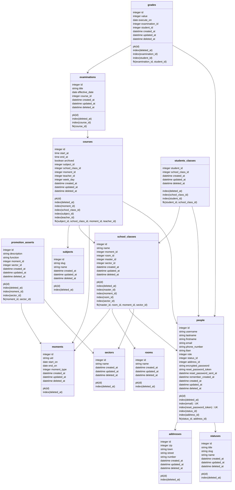

# MLD Actual Database Schema

```mermaid
classDiagram
    promotion_asserts --> moments
    promotion_asserts --> sectors
    courses --> subjects
    courses --> school_classes
    courses --> moments
    courses --> people
    examinations --> courses
    grades --> examinations
    grades --> people
    school_classes --> moments
    school_classes --> rooms
    school_classes --> people
    school_classes --> sectors
    students_classes --> school_classes
    students_classes --> people
    people --> addresses
    people --> statuses

    class addresses {
        integer id
        integer zip
        string town
        string street
        string number
        datetime created_at
        datetime updated_at
        datetime deleted_at
        pk(id)
        index(deleted_at)
    }

    class rooms {
        integer id
        string name
        datetime created_at
        datetime updated_at
        datetime deleted_at
        pk(id)
        index(deleted_at)
    }

    class school_classes {
        integer id
        string name
        integer moment_id
        integer room_id
        integer master_id
        integer sector_id
        datetime created_at
        datetime updated_at
        datetime deleted_at
        pk(id)
        index(deleted_at)
        index(master_id)
        index(moment_id)
        index(room_id)
        index(sector_id)
        fk(master_id, room_id, moment_id, sector_id)
    }

    class people {
        integer id
        string username
        string lastname
        string firstname
        string email
        string phone_number
        string iban
        integer role
        integer status_id
        integer address_id
        string encrypted_password
        string reset_password_token
        datetime reset_password_sent_at
        datetime remember_created_at
        datetime created_at
        datetime updated_at
        datetime deleted_at
        pk(id)
        index(deleted_at)
        index(email) UK
        index(reset_password_token) UK
        index(status_id)
        index(address_id)
        fk(status_id, address_id)
    }

    class statuses {
        integer id
        string title
        string slug
        string name
        datetime created_at
        datetime updated_at
        datetime deleted_at
        pk(id)
        index(deleted_at)
    }

    class students_classes {
        integer student_id
        integer school_class_id
        datetime created_at
        datetime updated_at
        datetime deleted_at
        index(deleted_at)
        index(school_class_id)
        index(student_id)
        fk(student_id, school_class_id)
    }

    class sectors {
        integer id
        string name
        datetime created_at
        datetime updated_at
        datetime deleted_at
        pk(id)
        index(deleted_at)
    }

    class moments {
        integer id
        string uid
        date start_on
        date end_on
        integer moment_type
        datetime created_at
        datetime updated_at
        datetime deleted_at
        pk(id)
        index(deleted_at)
    }

    class subjects {
        integer id
        string slug
        string name
        datetime created_at
        datetime updated_at
        datetime deleted_at
        pk(id)
        index(deleted_at)
    }

    class courses {
        integer id
        time start_at
        time end_at
        boolean archived
        integer subject_id
        integer school_class_id
        integer moment_id
        integer teacher_id
        integer week_day
        datetime created_at
        datetime updated_at
        datetime deleted_at
        pk(id)
        index(deleted_at)
        index(moment_id)
        index(school_class_id)
        index(subject_id)
        index(teacher_id)
        fk(subject_id, school_class_id, moment_id, teacher_id)
    }

    class examinations {
        integer id
        string title
        date effective_date
        integer course_id
        datetime created_at
        datetime updated_at
        datetime deleted_at
        pk(id)
        index(deleted_at)
        index(course_id)
        fk(course_id)
    }

    class grades {
        integer id
        integer value
        date execute_on
        integer examination_id
        integer student_id
        datetime created_at
        datetime updated_at
        datetime deleted_at
        pk(id)
        index(deleted_at)
        index(examination_id)
        index(student_id)
        fk(examination_id, student_id)
    }

    class promotion_asserts {
        integer id
        string description
        string function
        integer moment_id
        integer sector_id
        datetime created_at
        datetime updated_at
        datetime deleted_at
        pk(id)
        index(deleted_at)
        index(moment_id)
        index(sector_id)
        fk(moment_id, sector_id)
    }
``` 